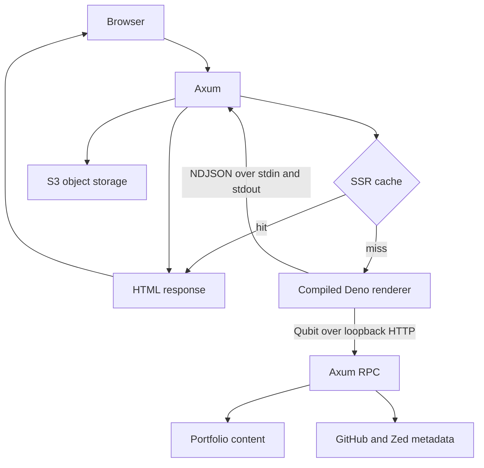

# Portfolio

A bilingual, server-rendered portfolio built around a Rust HTTP core and an Ilha
frontend.

Axum is the only public application server. Ilha performs runtime SSR inside a
compiled Deno process, giving the frontend a TypeScript rendering environment
without putting Deno, Node.js, or Bun in front of the application—or requiring
an installed JavaScript runtime in the production image.

> [Ilha](https://ilha.build) is an island architecture library for rendering
> pages on the server and hydrating only the interactive parts in the browser.

## Technology

| Area | Technology |
| --- | --- |
| HTTP and application state | Rust, Axum, Tokio |
| Server rendering | Ilha in a compiled Deno renderer |
| Browser application | Ilha, TypeScript, Vite, Tailwind CSS |
| Type-safe API | Qubit RPC with Rust-generated TypeScript types |
| Object storage | S3-compatible storage |
| Email | Resend |
| Observability | Prometheus and Fly.io Grafana |
| Deployment | Fly.io in Stockholm (`arn`) |

## Architecture

The application deliberately separates HTTP ownership from UI rendering.



### Axum as the application boundary

Axum owns the public port, routing, state, caching, compression, metrics, email,
and object delivery. The Deno process is private implementation detail: it has
no listening socket and never serves browser traffic.

This keeps deployment and security centered around one HTTP server while still
allowing Ilha to render in its native TypeScript environment.

### The renderer process

The frontend build produces a standalone executable with `deno compile`.
Axum starts that executable before binding port 8080 and keeps it alive as a
long-running child process.

Rendering uses a small NDJSON protocol:

1. Rust writes one `RenderInput` JSON object followed by a newline.
2. Deno renders the requested Ilha route.
3. Deno writes one `RenderOutput` object followed by a newline.
4. Rust validates the response ID and turns the result into an Axum response.

If the renderer exits, returns malformed output, times out, or responds with the
wrong request ID, Axum discards it. A later cache miss starts a fresh process.

The process boundary keeps V8 and frontend dependencies out of the Rust address
space. It also avoids embedding a JavaScript engine through `deno_core`, which
would make the Rust binary and runtime integration considerably more complex.

### Runtime SSR

The renderer imports Ilha's generated server page registry and keeps all route
loader wiring in `frontend/src/render.ts`.

For each page it:

- Requests portfolio data from Axum's internal Qubit endpoint.
- Requests enriched experience data only for `/experience`.
- Renders the route with Ilha.
- Renders hydratable header and footer islands.
- Produces the complete document shell, hydration markers, stylesheet entry,
  and browser module entry.

Axum then injects the embedded font declarations and sends the document with
HTTP compression.

The browser does not issue fallback data queries for page content. It receives a
complete document and hydrates only the interactive behavior.

### Islands and navigation

The header, footer, theme controls, locale controls, contact form, and cellular
automata interface are interactive islands. Static page content remains ordinary
server-rendered HTML.

Client-side route interception is disabled. Navigation returns through Axum,
which means every route has the same SSR, status handling, caching, and
observability path.

## Data flow

Portfolio content is compiled into the Rust application from
`backend/data/data.json`. Qubit exposes that content to the renderer through a
type-safe API.

The experience route enriches configured entries with live information:

- GitHub stars and forks
- Zed extension download counts

That upstream data is cached for three days. If an upstream item is unavailable,
the configured portfolio data remains usable.

The contact form calls a Qubit mutation, and Axum dispatches the email through
Resend. The browser never communicates with Resend directly.

Rust types are exported to TypeScript, so RPC calls and the renderer protocol
share the same request and response shapes across the process boundary.

## Language and theme

English and Norwegian content are present in the rendered document. The browser
selects the initial locale from a saved preference or `navigator.language`, and
Ilha switches the visible locale without fetching another copy of the page data.

Dark mode is the default. A small script in the document head applies a saved
light or dark preference before the stylesheet is evaluated, preventing a theme
flash during hydration.

## Caching and latency

The application uses several cache layers for different kinds of work.

### SSR cache

Axum keeps a 60-second in-memory cache of successful renders. The key is a Rust
enum containing only the five public routes, so arbitrary URLs and query strings
cannot grow the cache.

On concurrent misses, requests recheck the cache after acquiring the renderer
lock. The first request performs SSR; queued requests reuse its result instead
of rendering the same page repeatedly.

### Data cache

Experience metadata is cached independently for three days. A short HTML cache
therefore does not cause expensive upstream refreshes.

### Vite assets

Vite emits content-hashed JavaScript and CSS files. Axum serves `/assets/*` with:

```http
Cache-Control: public, max-age=31536000, immutable
```

A new frontend build produces new filenames, allowing existing assets to remain
cached permanently without revalidation.

### Fonts

Alef 400 and 700 are stored as Latin-subset WOFF2 objects in S3 object storage. Together
they are about 40 KB before base64 encoding.

Axum fetches both objects concurrently during startup and embeds them into the
HTML as `data:font/woff2` sources. Font loading therefore adds no browser HTTP
requests or request waterfall. The HTML response compressor reduces the cost of
the encoded payload on the wire.

### Object storage gateway

Images, the résumé, automata JavaScript, and WebAssembly remain in S3 object storage. Axum
provides an allowlisted streaming gateway at `/static/*` and preserves normal
HTTP asset semantics:

- Entity tags and conditional requests
- Byte ranges and partial responses
- Upstream cache metadata
- Content lengths and content ranges
- A one-hour cache fallback with `stale-while-revalidate`

Large objects can start streaming without being buffered into application
memory. Invalid static paths receive a cheap local 404 and never invoke S3 or
the SSR renderer.

## Failure behavior

The HTTP server remains in control when dependencies fail:

- Invalid page paths return a static 404 without invoking Deno.
- Invalid static paths return a static 404 without invoking S3.
- Missing S3 objects return 404.
- Invalid ranges return 416.
- S3 object service failures return 502 rather than being disguised as missing
  files.
- Renderer communication failures return 503.
- Renderer-reported application failures return 500.

The renderer has a five-second end-to-end deadline that includes time waiting
for the renderer lock.

## Observability

Prometheus metrics are exposed at `/api/metrics`. Alongside HTTP request metrics,
the application records:

- SSR cache hits, misses, and coalesced requests
- Renderer lock wait duration
- Renderer exchange duration by outcome
- Renderer process starts and discards

All labels are selected from fixed route and outcome values, avoiding unbounded
metric cardinality.

## Build and deployment

Cargo and the frontend build are independent. Rust compilation does not invoke
Vite or Deno. The root `just` tasks coordinate them when building or running the
complete application.

```sh
just init    # install the Deno dependencies
just dev     # build the frontend renderer and run Axum
just lint    # validate Rust, TypeScript, formatting, and generated integration
just build   # build the production frontend and Rust backend
```

The production image uses three pinned stages:

1. Deno 2.9.4 builds the browser assets and compiles the SSR renderer.
2. Rust 1.95 builds the Axum backend with thin LTO and stripped symbols.
3. Debian Bookworm Slim contains the backend, one renderer executable, Vite
   assets, static metadata files, and TLS certificates.

The renderer is moved out of `frontend/dist` before that directory is copied,
preventing the largest artifact from appearing twice in the image. The runtime
process uses an unprivileged user, and no development JavaScript runtime or
package manager is included.

Fly runs the application on a `shared-cpu-1x` Machine with 256 MB of memory.
Machines start when traffic arrives and stop when idle, trading cold-start
latency for lower idle cost. Startup fetches the embedded-font sources and
spawns the renderer before the server begins accepting requests.

## Repository map

```text
portfolio/
├── backend/                    Axum application and public runtime
│   ├── src/
│   │   ├── main.rs             Router and server entry point
│   │   ├── state.rs            Shared services, caches, fonts, and metrics
│   │   ├── renderer.rs         Deno process, NDJSON IPC, and SSR cache
│   │   ├── routes/             Pages, RPC, email, and asset delivery
│   │   └── types/              Content model and renderer protocol
│   ├── data/data.json          Bilingual portfolio content
│   └── static/                 Favicon, robots.txt, and sitemap
│
├── frontend/                   Ilha server and browser application
│   ├── src/
│   │   ├── render-worker.ts    Compiled Deno worker entry point
│   │   ├── render.ts           Loaders, SSR, islands, and document shell
│   │   ├── main.ts             Browser hydration entry point
│   │   ├── pages/              File-based routes
│   │   ├── islands/            Hydratable interactive UI
│   │   ├── components/         Shared presentation components
│   │   ├── lib/                RPC, locale, icons, and automata support
│   │   └── bindings/           Rust-generated TypeScript contracts
│   ├── vite.config.ts          Ilha, Tailwind, splitting, and manifest
│   └── deno.json               Frontend tasks and TypeScript configuration
│
├── cli/                        CLI for managing S3 Object Storage
├── .github/workflows/          CI and Fly deployment
├── Dockerfile                  Three-stage production image
├── fly.toml                    Fly service and VM configuration
├── deno.json / deno.lock       Root Deno workspace
└── justfile                    Cross-project task orchestration
```

The central process boundary is `backend/src/renderer.rs` ↔
`frontend/src/render-worker.ts`. Server rendering lives in
`frontend/src/render.ts`; browser hydration begins in `frontend/src/main.ts`.
